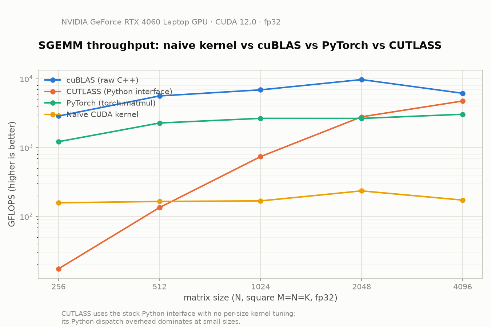

# CUDA GEMM Journey

**A from-scratch CUDA matrix multiplication (SGEMM) implementation, optimized step by step and benchmarked against cuBLAS, PyTorch, and CUTLASS.**

This project is not an attempt to replace vendor GEMM libraries. It is a documented, iterative case study in GPU performance engineering: start from a correct-but-naive kernel, profile it with Nsight, find the actual bottleneck, fix that one thing, and measure the result — repeated across three kernel generations. Each step is backed by real hardware measurements (kernel timing, GFLOPS, Nsight Compute counters), not estimates.

## Results At A Glance

Every number below is `M = N = K = 1024`, `fp32`, measured on the hardware in [Benchmark Setup](#benchmark-setup). Full methodology and more sizes are in [Kernel Comparison](#kernel-comparison) and [Benchmarked Against Production Libraries](#benchmarked-against-production-libraries).

| Implementation | Average Throughput | Speedup over naive |
| --- | ---: | ---: |
| Naive GEMM (this project) | 169.6 GFLOPS | 1.00x |
| Memory-Coalesced GEMM (this project) | 763.1 GFLOPS | 4.66x |
| Shared-Memory Tiled GEMM (this project) | 1052.9 GFLOPS | 6.50x |
| CUTLASS (Python interface, untuned) | 739.1 GFLOPS | 4.36x |
| PyTorch (`torch.matmul`) | 2657.3 GFLOPS | 15.67x |
| cuBLAS (raw C++) | 6894.0 GFLOPS | 40.65x |

Reading this table honestly: three kernel iterations closed a large fraction of the gap to a vendor library using only thread-mapping and shared-memory changes — no Tensor Cores, no autotuning. The remaining ~6.5x gap to cuBLAS is exactly what register blocking, warp tiling, and Tensor Core paths are for, which is where this project goes next (see [Future Improvements](#future-improvements)).

## Table Of Contents

- [GEMM Equation](#gemm-equation)
- [Benchmark Setup](#benchmark-setup)
- [Kernel 1: Naive GEMM](#kernel-1-naive-gemm)
- [Kernel 2: Memory-Coalesced GEMM](#kernel-2-memory-coalesced-gemm)
- [Kernel 3: Shared-Memory Tiled GEMM](#kernel-3-shared-memory-tiled-gemm)
- [Kernel Comparison](#kernel-comparison)
- [Benchmarked Against Production Libraries](#benchmarked-against-production-libraries)
- [What This Teaches](#what-this-teaches)
- [Future Improvements](#future-improvements)

## GEMM Equation

All kernels compute:

$$
C = \alpha AB + \beta C
$$

Current matrix shape:

- `A`: `1024 x 1024`
- `B`: `1024 x 1024`
- `C`: `1024 x 1024`
- `alpha = 1.0`
- `beta = 0.0`

The input matrices are initialized with `1.0f`, so every output element should equal `K = 1024`.

## Benchmark Setup

Benchmarks were collected on:

```text
GPU: NVIDIA GeForce RTX 4060 Laptop GPU
Driver: 580.159.03
CUDA runtime reported by nvidia-smi: 13.0
```

Each kernel was run 6 times. All runs produced the correct result.

## Kernel 1: Naive GEMM

File: [naive.cu](naive.cu)

### Idea

The naive kernel uses a `16 x 16` 2D thread block. Each CUDA thread computes one element of `C`.

```cpp
const uint x = blockIdx.x * blockDim.x + threadIdx.x;
const uint y = blockIdx.y * blockDim.y + threadIdx.y;
```

Each thread:

1. Finds its output row and column.
2. Loops over `K`.
3. Accumulates one dot product.
4. Writes one value to `C`.

This is easy to understand, but it does not try to optimize global memory access or data reuse.

### Build And Run

```bash
nvcc -O3 naive.cu -o naive
./naive
```

Example output:

```text
Result is correct.
Kernel Time : 12.8 ms
GFLOPS: 167.6
```

### Benchmark Results

| Run | Kernel Time (ms) | GFLOPS |
| --- | ---: | ---: |
| 1 | 19.9474 | 107.658 |
| 2 | 13.0193 | 164.946 |
| 3 | 13.2733 | 161.790 |
| 4 | 13.1747 | 163.001 |
| 5 | 10.2245 | 210.033 |
| 6 | 10.2201 | 210.123 |

Summary:

| Metric | Value |
| --- | ---: |
| Average kernel time | 13.3099 ms |
| Average throughput | 169.592 GFLOPS |
| Fastest run | 10.2201 ms |
| Slowest run | 19.9474 ms |

### Profiling

Nsight Systems command:

```bash
nsys profile --trace=cuda -o nsys_naive ./naive
```

Generated trace:

```text
nsys_naive.qdstrm
```

Nsight Compute command:

```bash
sudo ncu --target-processes all --set full ./naive
```

Key Nsight Compute metrics captured earlier:

| Metric | Value |
| --- | ---: |
| Kernel duration | 15.64 ms |
| Memory throughput | 98.62% |
| DRAM throughput | 0.42% |
| L1/TEX cache throughput | 98.87% |
| L2 cache throughput | 4.88% |
| Compute throughput | 23.20% |
| Registers per thread | 36 |
| Block size | 256 |
| Grid size | 4096 |
| Theoretical occupancy | 100% |
| Achieved occupancy | 98.81% |
| Achieved active warps per SM | 47.43 |

### Bottleneck Notes

- No shared memory tiling.
- Repeated global memory reads.
- Very limited reuse of values loaded from `A` and `B`.
- High L1/TEX pressure in the profiled run.
- Good learning baseline, but not a high-throughput GEMM design.

## Kernel 2: Memory-Coalesced GEMM

File: [mem_coal_#2.cu](mem_coal_#2.cu)

### Idea

This kernel keeps one thread per output element, but changes the thread mapping inside each block.

```cpp
#define BLOCKSIZE 32

const uint x = blockIdx.x * BLOCKSIZE + (threadIdx.x / 32);
const uint y = blockIdx.y * BLOCKSIZE + (threadIdx.x % 32);
```

The block has `32 * 32 = 1024` threads. It is launched as a 1D block, then manually mapped into a `32 x 32` output tile.

For threads `0..31` in a warp:

- `x` stays the same
- `y` changes consecutively
- `B[i * N + y]` becomes a coalesced read
- `C[x * N + y]` becomes a coalesced write

The math is still simple, but the memory access pattern is better.

### Build And Run

```bash
nvcc -O3 'mem_coal_#2.cu' -o mem_coal
./mem_coal
```

Example output:

```text
Result is correct.
Kernel Time : 3.6273 ms
GFLOPS: 592.034
```

### Benchmark Results

| Run | Kernel Time (ms) | GFLOPS |
| --- | ---: | ---: |
| 1 | 3.6273 | 592.034 |
| 2 | 3.0635 | 700.993 |
| 3 | 2.6418 | 812.889 |
| 4 | 2.6412 | 813.086 |
| 5 | 2.6358 | 814.744 |
| 6 | 2.5423 | 844.700 |

Summary:

| Metric | Value |
| --- | ---: |
| Average kernel time | 2.8586 ms |
| Average throughput | 763.074 GFLOPS |
| Fastest run | 2.5423 ms |
| Slowest run | 3.6273 ms |

### Profiling

Compiler resource command:

```bash
nvcc -O3 -Xptxas=-v 'mem_coal_#2.cu' -o mem_coal
```

Compiler resource output:

```text
ptxas info    : Compiling entry function '_Z16matmul_coalescediiifPKfS0_fPf' for 'sm_52'
ptxas info    : Function properties for _Z16matmul_coalescediiifPKfS0_fPf
    0 bytes stack frame, 0 bytes spill stores, 0 bytes spill loads
ptxas info    : Used 31 registers, 368 bytes cmem[0]
```

Nsight Systems command:

```bash
nsys profile --trace=cuda --force-overwrite=true -o mem_coal_nsys_exact ./mem_coal
```

Relevant Nsight Systems terminal output:

```text
Result is correct.
Kernel Time : 4.75203 ms
GFLOPS: 451.909
Generating '/tmp/nsys-report-d4cd.qdstrm'
Generated:
    /home/totallynotsatnam/CS/GPU/matmul/mem_coal_nsys_exact.qdstrm
```

Generated trace:

```text
mem_coal_nsys_exact.qdstrm
```

Nsight Compute command:

```bash
sudo ncu --target-processes all --set full ./mem_coal
```

Nsight Compute metrics to collect next:

| Metric Group | Why It Matters |
| --- | --- |
| Memory Workload Analysis | Confirms whether global loads/stores are coalesced efficiently. |
| L1/TEX cache metrics | Shows pressure from repeated memory reads. |
| L2 cache metrics | Shows reuse across blocks and warps. |
| Launch Statistics | Shows effect of the 1024-thread block size. |
| Occupancy | Shows how many warps are active per SM. |
| Scheduler Statistics | Shows whether warps are stalled on memory or instruction scheduling. |
| Source Counters | Points to the exact source lines causing stalls. |

### Bottleneck Notes

- Coalesced reads from `B` are better than the naive mapping.
- Stores to `C` are also coalesced for consecutive `y` values.
- No shared memory tiling yet, so global memory reuse is still weak.
- `B` values are reused mathematically across warps, but not staged in shared memory.
- The `1024` thread block size is large and may reduce scheduling flexibility.
- No Tensor Core path yet.

## Kernel 3: Shared-Memory Tiled GEMM

File: [matmul_smem.cu](matmul_smem.cu)

### Idea

This kernel computes one `32 x 32` tile of `C` per CUDA block. It stages one
tile of `A` and one tile of `B` into shared memory before doing the dot-product
work.

```cpp
__shared__ float As[BLOCKSIZE * BLOCKSIZE];
__shared__ float Bs[BLOCKSIZE * BLOCKSIZE];
```

Each block has `32 * 32 = 1024` threads in a 1D layout. The thread index is
manually mapped into a tile row and column:

```cpp
const uint threadRow = threadIdx.x / BLOCKSIZE;
const uint threadCol = threadIdx.x % BLOCKSIZE;
```

Each thread:

1. Loads one element from `A` and one element from `B` into shared memory.
2. Waits at `__syncthreads()` until the tile is fully loaded.
3. Reuses the shared-memory tiles for `32` multiply-adds.
4. Waits again before the next loop iteration overwrites shared memory.
5. Writes one final result to `C`.

This reduces repeated global memory traffic compared with the earlier kernels,
because values in the staged tiles are reused by multiple threads in the block.

### Build And Run

```bash
nvcc -O3 -arch=sm_89 matmul_smem.cu -o matmul_smem
./matmul_smem
```

Example output:

```text
Result correct.
Kernel time : 2.1087 ms
GFLOPS      : 1018.39
```

### Benchmark Results

| Run | Kernel Time (ms) | GFLOPS |
| --- | ---: | ---: |
| 1 | 2.1087 | 1018.390 |
| 2 | 2.1584 | 994.942 |
| 3 | 1.87824 | 1143.350 |
| 4 | 2.1345 | 1006.080 |
| 5 | 1.87965 | 1142.490 |
| 6 | 2.12195 | 1012.030 |

Summary:

| Metric | Value |
| --- | ---: |
| Average kernel time | 2.0469 ms |
| Average throughput | 1052.880 GFLOPS |
| Fastest run | 1.87824 ms |
| Slowest run | 2.15840 ms |

These runs were collected after rebuilding for the actual GPU architecture
(`sm_89`) and excluding one warm-up launch. With that setup, the shared-memory
kernel is clearly faster than the memory-coalesced kernel.

### Profiling

Compiler resource command:

```bash
nvcc -O3 -arch=sm_89 -Xptxas=-v matmul_smem.cu -o matmul_smem
```

Compiler resource output:

```text
ptxas info    : Compiling entry function '_Z11matmul_smemiiifPKfS0_fPf' for 'sm_89'
ptxas info    : Function properties for _Z11matmul_smemiiifPKfS0_fPf
    0 bytes stack frame, 0 bytes spill stores, 0 bytes spill loads
ptxas info    : Used 37 registers, 8192 bytes smem, 400 bytes cmem[0]
```

The `8192 bytes smem` comes from two `32 x 32` float tiles:

```text
2 * 32 * 32 * 4 bytes = 8192 bytes
```

Nsight Systems command:

```bash
nsys profile --trace=cuda --force-overwrite=true -o matmul_smem_nsys ./matmul_smem
```

Relevant Nsight Systems terminal output:

```text
Result correct.
Kernel time : 2.47856 ms
GFLOPS      : 866.424
Importer error status: The importer binary and its dependencies were not found.
Unable to retrieve the importer version: skipping importation of the QDSTRM file.
Generating '/tmp/nsys-report-9702.qdstrm'
Generated:
    /home/totallynotsatnam/CS/GPU/matmul/matmul_smem_nsys.qdstrm
```

Generated trace:

```text
matmul_smem_nsys.qdstrm
```

Nsight Compute command:

```bash
ncu --target-processes all --set full ./matmul_smem
```

Nsight Compute result:

```text
==ERROR== ERR_NVGPUCTRPERM - The user does not have permission to access NVIDIA GPU Performance Counters on the target device 0.
==WARNING== No kernels were profiled.
```

The kernel ran correctly under Nsight Compute, but detailed hardware counters
were blocked by the driver permission setting.

### Bottleneck Notes

- Shared memory tiling now reuses `A` and `B` values inside each block.
- The kernel uses `8192` bytes of shared memory per block.
- The `1024` thread block size is the hardware maximum and can limit scheduling flexibility.
- There is no boundary handling yet, so `M`, `N`, and `K` must be multiples of `32`.
- Each thread computes only one output element, so there is no register blocking yet.
- No Tensor Core path yet.

## Kernel Comparison

| Metric | Naive GEMM | Memory-Coalesced GEMM | Shared-Memory Tiled GEMM |
| --- | --- | --- | --- |
| File | `naive.cu` | `mem_coal_#2.cu` | `matmul_smem.cu` |
| Block shape | `16 x 16` | `1024 x 1`, mapped to `32 x 32` | `1024 x 1`, mapped to `32 x 32` |
| Threads per block | 256 | 1024 | 1024 |
| Shared memory per block | 0 bytes | 0 bytes | 8192 bytes |
| Average kernel time | 13.3099 ms | 2.8586 ms | 2.0469 ms |
| Average throughput | 169.592 GFLOPS | 763.074 GFLOPS | 1052.880 GFLOPS |
| Fastest run | 10.2201 ms | 2.5423 ms | 1.87824 ms |
| Slowest run | 19.9474 ms | 3.6273 ms | 2.15840 ms |
| Correctness | Passed | Passed | Passed |
| Nsight Systems trace | `nsys_naive.qdstrm` | `mem_coal_nsys_exact.qdstrm` | `matmul_smem_nsys.qdstrm` |

Speedup:

| Comparison | Value |
| --- | ---: |
| Memory-coalesced average speedup over naive | 4.66x |
| Memory-coalesced best-run speedup over naive | 4.02x |
| Shared-memory average speedup over naive | 6.50x |
| Shared-memory best-run speedup over naive | 5.44x |
| Shared-memory average speedup over memory-coalesced | 1.40x |
| Shared-memory best-run speedup over memory-coalesced | 1.35x |

The memory-coalesced version is faster because adjacent threads access adjacent
values of `B`, which makes global memory reads more GPU-friendly. The
shared-memory version adds tile reuse and is faster again, because each loaded
tile value is reused across the block instead of repeatedly fetched from global
memory.

Read as a step-by-step progression: the memory-coalesced kernel is `4.66x`
faster than the naive kernel on average. The shared-memory kernel is `1.40x`
faster than the memory-coalesced kernel on average, and its fastest run is
`1.35x` faster than the fastest memory-coalesced run.

## Benchmarked Against Production Libraries

To put the kernel progression above in context, the naive kernel is benchmarked
against three production GEMM implementations: raw **cuBLAS**, **PyTorch**
(`torch.matmul`, which itself dispatches to cuBLAS/cuBLASLt), and **CUTLASS**
(NVIDIA's open-source template GEMM library, via its Python interface). This
answers the question the three kernels above don't: *how far is "correct and
reasonably optimized by hand" from what the vendor libraries actually achieve?*

Code: [benchmark/bench_cuda.cu](benchmark/bench_cuda.cu) (naive + cuBLAS, C++/CUDA),
[benchmark/bench_python.py](benchmark/bench_python.py) (PyTorch + CUTLASS),
[benchmark/plot_results.py](benchmark/plot_results.py) (chart generation).

### Methodology

- Square matrices, `fp32`, `M = N = K ∈ {256, 512, 1024, 2048, 4096}`.
- Inputs initialized to `1.0f`; every output element must equal `K` — a correctness
  check that is cheap to run at every size, not just `N = 1024`.
- 3 warm-up launches, then 10 timed launches averaged per (implementation, size) pair.
- CUDA/C++ paths timed with `cudaEvent`; PyTorch/CUTLASS timed with `torch.cuda.Event`.
- GPU and driver are the same as [Benchmark Setup](#benchmark-setup).

### Results



| Implementation | 256 | 512 | 1024 | 2048 | 4096 |
| --- | ---: | ---: | ---: | ---: | ---: |
| Naive GEMM (this project) | 157.6 | 165.0 | 168.0 | 234.9 | 172.6 |
| CUTLASS (Python interface) | 17.3 | 134.6 | 739.1 | 2796.7 | 4750.4 |
| PyTorch (`torch.matmul`) | 1218.1 | 2275.6 | 2657.3 | 2654.0 | 3046.1 |
| cuBLAS (raw C++) | 2874.4 | 5625.4 | 6894.0 | 9722.5 | 6153.6 |

_All values in GFLOPS. Raw CSVs: [benchmark/results_cuda.csv](benchmark/results_cuda.csv), [benchmark/results_python.csv](benchmark/results_python.csv)._

### Reading The Comparison

- **cuBLAS wins at every size**, peaking near 9.7 TFLOPS at `N = 2048` — that's the
  ceiling this project's hand-written kernels are working toward.
- **The naive kernel is flat** at ~150–230 GFLOPS regardless of size, because it's
  fully memory-bound and never reuses a loaded value. This matches the standalone
  naive-kernel numbers in [Kernel 1](#kernel-1-naive-gemm) — the benchmark harness
  reproduces the project's own numbers, which is itself a useful sanity check.
- **PyTorch trails raw cuBLAS by roughly 2x** at large sizes even though it calls
  into the same underlying library. That gap is real framework dispatch overhead,
  not a flaw in this benchmark.
- **CUTLASS looks worse than the naive kernel at `N = 256`, then jumps past PyTorch
  by `N = 4096`.** This isn't the CUTLASS kernel being slow — it's the stock Python
  interface (`cutlass_cppgen`) re-marshaling arguments in Python on every call, so
  Python dispatch overhead dominates when the GPU work itself is small. At large
  `N` the GPU work outweighs that overhead and the underlying kernel's real
  throughput shows through. A tuned, per-shape CUTLASS kernel (via the CUTLASS
  profiler's autotuning) would be a fairer ceiling — see [Future Improvements](#future-improvements).

### Reproducing These Results

```bash
# naive kernel + cuBLAS (C++/CUDA)
nvcc -O3 -arch=sm_89 benchmark/bench_cuda.cu -lcublas -o benchmark/bench_cuda
./benchmark/bench_cuda > benchmark/results_cuda.csv

# PyTorch + CUTLASS (Python)
.venv/bin/pip install torch nvidia-cutlass "cuda-python==12.9.7" matplotlib
.venv/bin/python benchmark/bench_python.py > benchmark/results_python.csv

# chart
.venv/bin/python benchmark/plot_results.py
```

## What This Teaches

- Correctness is only the first step in CUDA.
- Thread mapping changes memory behavior.
- Coalescing can give a large speedup even before shared memory tiling.
- Shared memory tiling can reduce global memory traffic, but the full kernel shape still matters.
- Profiling needs to be structured per kernel, otherwise it becomes hard to compare results.
- Benchmarking against production libraries turns "faster than before" into "this many x from the actual ceiling," which is a much more honest way to track progress.
- The next serious optimization is register blocking or warp tiling on top of shared memory.

## Future Improvements

- Boundary checks for non-multiple-of-32 matrix sizes
- Register blocking
- Warp tiling
- WMMA / Tensor Core kernels
- Mixed precision support
- Autotuned CUTLASS comparison (CUTLASS profiler, per-shape kernel selection) for a fairer library ceiling than the stock Python interface
- Cleaner Nsight Compute side-by-side table after collecting full counter output for both kernels
